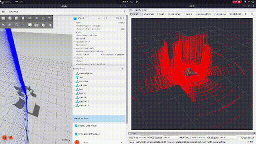
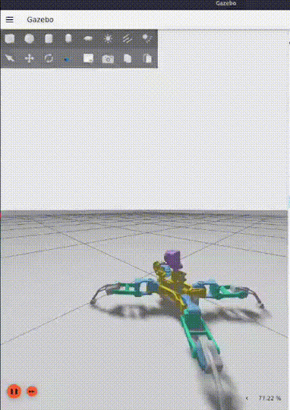

# RECCOBOT - Quadruped Robot with 3D Mapping and Deep RL# RECCO_BOT


<div align="center">A ROS 2 workspace containing the RECCO_BOT robot project, including robot description files, URDF models, and associated submodules for autonomous navigation and perception.


## Table of Contents


*Real-time 3D mapping using rotating 2D LiDAR*- [Overview](#overview)

- [Repository Structure](#repository-structure)

- [Prerequisites](#prerequisites)

- [Installation](#installation)

*Autonomous navigation in Gazebo simulation*- [Building the Workspace](#building-the-workspace)

- [Running the Robot](#running-the-robot)

</div>- [Packages](#packages)

- [Troubleshooting](#troubleshooting)

A ROS 2 workspace containing the RECCOBOT project - a versatile quadruped robot platform designed for reconnaissance, exploration, and autonomous navigation tasks. Features include 3D mapping using rotating 2D LiDAR, deep reinforcement learning for locomotion, ROS 2 control integration, and Gazebo simulation.- [Contributing](#contributing)


## 🌟 Key Features---


- **Quadruped Robot Design**: 12 DOF leg system with 3 joints per leg (coxa, femur, tibia)## Overview

- **3D Mapping**: Rotating 2D LiDAR creates 3D point clouds for environment mapping

- **Deep Reinforcement Learning**: PPO-based training for quadruped locomotionThis workspace contains the complete software stack for the RECCO_BOT, a quadruped robot designed for reconnaissance and exploration tasks. The project includes robot description files, visualization tools, and integration with various sensors including LiDAR and cameras.

- **ROS 2 Control Integration**: Hardware-agnostic control using ros2_control framework

- **Gazebo Simulation**: Full robot simulation with physics and sensor plugins---

- **Sensor Suite**: LiDAR, RGB camera with pan-tilt, IMU

- **State Machine**: Behavior coordination and task management## Repository Structure

- **Real-time Visualization**: RViz2 with custom configurations

```

---reccobot_ws/

├── src/

## 📋 Table of Contents│   ├── reccobot_description/    # Robot URDF models and meshes

│   ├── reccobot_state_machine/  # State machine implementation

- [Overview](#overview)│   ├── Person_MinkUNet/         # Person detection submodule

- [Repository Structure](#repository-structure)│   └── README.md                # This file

- [Prerequisites](#prerequisites)```

- [Installation](#installation)

- [Building the Workspace](#building-the-workspace)---

- [Quick Start](#quick-start)

- [Packages](#packages)## Prerequisites

- [Features in Detail](#features-in-detail)

- [Training Deep RL Agent](#training-deep-rl-agent)Before building this workspace, ensure you have the following installed:

- [3D Mapping with LiDAR](#3d-mapping-with-lidar)

- [Troubleshooting](#troubleshooting)- **Ubuntu 22.04** (Jammy Jellyfish) or compatible

- [Contributing](#contributing)- **ROS 2 Humble** (or your target ROS 2 distribution)

- **Python 3.10+**

---- **Colcon build tools**


## 🤖 Overview### Install ROS 2 Dependencies


RECCOBOT is a comprehensive quadruped robotics platform built on ROS 2 Humble. The project demonstrates advanced robotics concepts including:```bash

sudo apt update

- **Kinematics & Dynamics**: Full URDF model with accurate mass properties and inertiasudo apt install -y \

- **Sensor Fusion**: Integration of LiDAR, camera, and IMU data    ros-${ROS_DISTRO}-robot-state-publisher \

- **Autonomous Navigation**: Deep RL-trained walking behaviors    ros-${ROS_DISTRO}-joint-state-publisher \

- **3D Perception**: Converting 2D LiDAR scans to 3D point clouds through rotation    ros-${ROS_DISTRO}-joint-state-publisher-gui \

- **Control Systems**: Position and velocity control using ros2_control    ros-${ROS_DISTRO}-rviz2 \

- **Simulation to Reality**: Gazebo-based development with real hardware deployment path    ros-${ROS_DISTRO}-xacro \

    python3-colcon-common-extensions

---```


## 📁 Repository Structure---


```## Installation

reccobot_ws/

├── src/### Clone the Repository

│   ├── reccobot_description/         # Robot URDF, meshes, launch files

│   │   ├── urdf/                     # URDF robot descriptionsAlways clone this repository with its submodules to ensure all dependencies are initialized correctly:

│   │   ├── meshes/                   # STL 3D models

│   │   ├── launch/                   # Launch files for visualization & simulation```bash

│   │   ├── scripts/                  # Deep RL training scriptsgit clone --recurse-submodules https://github.com/divyansh-ramola/RECCO_BOT.git

│   │   ├── worlds/                   # Gazebo world filescd RECCO_BOT

│   │   └── rviz/                     # RViz configurations```

│   │

│   ├── reccobot_controllers/         # ROS 2 Control configuration### If You Forgot the --recurse-submodules Flag

│   │   ├── config/                   # Controller parameters

│   │   └── launch/                   # Controller launch filesIf you already cloned the repository without submodules, initialize them with:

│   │

│   ├── reccobot_lidar_control/       # LiDAR rotation for 3D mapping```bash

│   │   ├── src/                      # C++ node for lidar rotationgit submodule update --init --recursive

│   │   └── launch/                   # LiDAR control launch files```

│   │

│   ├── reccobot_state_machine/       # Behavior state machine---

│   │   └── reccobot_state_machine/   # Python state machine implementation

│   │## Building the Workspace

│   ├── ldrobot-lidar-ros2/           # LDRobot LiDAR driver

│   │   └── ldlidar_node/             # ROS 2 node for LiDARNavigate to the workspace root and build all packages:

│   │

│   ├── articubot_one/                # Reference robot examples```bash

│   ├── 3D-Mapping-Using-2D-LiDAR-ROS/ # 3D mapping algorithmscd ~/reccobot_ws

│   ├── SpiderBot_DeepRL/             # Deep RL training frameworkcolcon build

│   └── images/                       # Documentation images and GIFs```

│

├── build/                            # Build artifactsTo build a specific package:

├── install/                          # Installed packages

└── log/                              # Build and runtime logs```bash

```colcon build --packages-select reccobot_description

```

---

After building, source the workspace:

## 🔧 Prerequisites

```bash

### System Requirementssource install/setup.bash

```

- **OS**: Ubuntu 22.04 (Jammy Jellyfish) or compatible

- **ROS 2**: Humble Hawksbill**Note:** Add this line to your `~/.bashrc` for automatic sourcing:

- **Python**: 3.10+

- **Gazebo**: Fortress or Harmonic (for simulation)```bash

echo "source ~/reccobot_ws/install/setup.bash" >> ~/.bashrc

### Install ROS 2 Humble```


If you haven't installed ROS 2 Humble yet:---


```bash## Running the Robot

# Add ROS 2 repository

sudo apt update && sudo apt install -y software-properties-common### Launch Robot Visualization

sudo add-apt-repository universe

sudo apt update && sudo apt install -y curlTo visualize the robot model in RViz with TF frames:

sudo curl -sSL https://raw.githubusercontent.com/ros/rosdistro/master/ros.key -o /usr/share/keyrings/ros-archive-keyring.gpg

echo "deb [arch=$(dpkg --print-architecture) signed-by=/usr/share/keyrings/ros-archive-keyring.gpg] http://packages.ros.org/ros2/ubuntu $(. /etc/os-release && echo $UBUNTU_CODENAME) main" | sudo tee /etc/apt/sources.list.d/ros2.list > /dev/null```bash

source ~/reccobot_ws/install/setup.bash

# Install ROS 2 Humbleros2 launch reccobot_description display.launch.py

sudo apt update```

sudo apt install -y ros-humble-desktop

```This will launch:

- Robot State Publisher (publishes robot model and TF transforms)

### Install Dependencies- Joint State Publisher GUI (control joint positions)

- RViz2 (visualization with pre-configured display settings)

```bash

sudo apt update### Verify Package Installation

sudo apt install -y \

    ros-humble-robot-state-publisher \To verify that packages are correctly installed:

    ros-humble-joint-state-publisher \

    ros-humble-joint-state-publisher-gui \```bash

    ros-humble-rviz2 \ros2 pkg list | grep reccobot

    ros-humble-xacro \```

    ros-humble-ros2-control \

    ros-humble-ros2-controllers \Expected output:

    ros-humble-controller-manager \```

    ros-humble-gazebo-ros-pkgs \reccobot_description

    ros-humble-gazebo-ros2-control \reccobot_state_machine

    python3-colcon-common-extensions \```

    python3-rosdep \

    python3-pip### Check Available Launch Files


# Deep RL dependencies (optional, for training)```bash

pip3 install stable-baselines3 gymnasium torch tensorboardros2 launch reccobot_description --show-args

``````


### Initialize rosdep---


```bash## Packages

sudo rosdep init

rosdep update### reccobot_description

```

Contains the URDF robot model, mesh files, and visualization launch files. The robot model includes:

---- 4-legged quadruped base with 12 degrees of freedom

- LiDAR sensor mount with rotation capability

## 📥 Installation- Camera system with pan-tilt mechanism

- Battery and electronic component models

### Clone the Repository

See the [reccobot_description README](reccobot_description/README.md) for detailed information.

```bash

# Create workspace directory### reccobot_state_machine

mkdir -p ~/reccobot_ws/src

cd ~/reccobot_ws/srcState machine implementation for robot behavior control and task execution.


# Clone the repository### Person_MinkUNet

git clone https://github.com/divyansh-ramola/RECCO_BOT.git .

```Submodule for person detection using MinkUNet architecture with 3D point cloud data.


### Install Package Dependencies---


```bash## Troubleshooting

cd ~/reccobot_ws

rosdep install --from-paths src --ignore-src -r -y### Issue: Package not found after building

```

**Solution:** Ensure you have sourced the workspace setup file:

---

```bash

## 🔨 Building the Workspacesource ~/reccobot_ws/install/setup.bash

```

### Build All Packages

### Issue: Missing dependencies during build

```bash

cd ~/reccobot_ws**Solution:** Install missing ROS 2 dependencies:

colcon build --symlink-install

``````bash

rosdep install --from-paths src --ignore-src -r -y

### Build Specific Package```


```bash### Issue: Submodules not initialized

colcon build --packages-select reccobot_description

```**Solution:** Initialize and update all submodules:


### Source the Workspace```bash

git submodule update --init --recursive

```bash```

source ~/reccobot_ws/install/setup.bash

```### Issue: RViz does not display robot model


**Tip:** Add to your `~/.bashrc` for automatic sourcing:**Solution:** Verify that robot_state_publisher is running:


```bash```bash

echo "source ~/reccobot_ws/install/setup.bash" >> ~/.bashrcros2 node list

source ~/.bashrcros2 topic echo /robot_description

``````


------


## 🚀 Quick Start## Contributing


### 1. Visualize Robot in RVizContributions are welcome. Please follow these guidelines:


View the robot model with interactive joint control:1. Fork the repository

2. Create a feature branch (`git checkout -b feature/your-feature`)

```bash3. Commit your changes with clear messages

ros2 launch reccobot_description display.launch.py4. Push to your branch (`git push origin feature/your-feature`)

```5. Open a Pull Request


### 2. Launch Gazebo Simulation---


Start the robot in a simulated environment:## License


```bashThis project is licensed under the terms specified in the LICENSE file.

ros2 launch reccobot_description gazebo.launch.py

```---


### 3. Start 3D Mapping## Contact


In a new terminal, start the LiDAR rotation for 3D mapping:For questions or support, please open an issue on the GitHub repository.


```bash**Repository:** [https://github.com/divyansh-ramola/RECCO_BOT](https://github.com/divyansh-ramola/RECCO_BOT)
source ~/reccobot_ws/install/setup.bash
ros2 launch reccobot_lidar_control lidar_rotation.launch.py
```

### 4. Control the Robot

Use keyboard teleop or the trained RL agent to move the robot.

---

## 📦 Packages

### reccobot_description

**Complete robot description and simulation package**

- URDF robot models with accurate kinematics
- 3D mesh files for all robot components
- Gazebo simulation launch files
- RViz visualization configurations
- Deep RL training scripts

**Key Features:**
- 12 DOF quadruped with 4 legs
- Rotating LiDAR mount (1 DOF)
- Camera pan-tilt mechanism (2 DOF)
- IMU sensor integration
- Physics-accurate collision meshes

📖 [Detailed Documentation](reccobot_description/README.md)

### reccobot_controllers

**ROS 2 Control integration package**

- Hardware-agnostic control interfaces
- Position and velocity controllers
- Joint trajectory controllers
- Controller configuration files

**Supported Controllers:**
- Joint State Broadcaster
- Position Controllers (per joint)
- Forward Command Controller
- Joint Trajectory Controller

### reccobot_lidar_control

**3D mapping through LiDAR rotation**

- Continuous rotation of 2D LiDAR sensor
- Configurable rotation speed and range
- Creates 3D point clouds from 2D scans
- Real-time TF frame updates

**Features:**
- Rotation range: -360° to +360°
- Adjustable speed: 0.1 to 2.0 rad/s
- Automatic direction reversal at limits
- Synchronized with TF transforms

📖 [Detailed Documentation](reccobot_lidar_control/README.md)

### reccobot_state_machine

**High-level behavior coordination**

- State machine for robot behaviors
- Task planning and execution
- Sensor-driven state transitions

### ldrobot-lidar-ros2

**LDRobot LiDAR driver integration**

- ROS 2 node for LDRobot LD06/LD19 LiDAR
- Publishes LaserScan messages
- SLAM integration support
- Component-based architecture

### Deep RL Framework (SpiderBot_DeepRL)

**Reinforcement learning for locomotion**

- PPO (Proximal Policy Optimization) implementation
- Custom Gymnasium environment
- Training and evaluation scripts
- Model checkpointing and logging

---

## 🎯 Features in Detail

### 3D Mapping System

The robot uses a rotating 2D LiDAR to create 3D point clouds:

1. **Hardware Setup**: 2D LiDAR mounted on a rotating servo
2. **Rotation Control**: Continuous back-and-forth rotation (-360° to +360°)
3. **Data Collection**: 2D scans captured at different angles
4. **3D Reconstruction**: TF transforms combine scans into 3D space
5. **Visualization**: Real-time point cloud in RViz

**Demo:**
```bash
# Terminal 1: Launch Gazebo
ros2 launch reccobot_description gazebo.launch.py

# Terminal 2: Start LiDAR rotation
ros2 launch reccobot_lidar_control lidar_rotation.launch.py

# Terminal 3: Visualize in RViz
ros2 launch reccobot_description display.launch.py
```

### Deep Reinforcement Learning

Train the quadruped to walk using PPO:

**Architecture:**
- **State Space**: Joint positions, velocities, body orientation, target velocity
- **Action Space**: Joint position commands (12 dimensions)
- **Reward Function**: Forward velocity, stability, energy efficiency
- **Algorithm**: PPO with MLP policy

**Training Process:**
```bash
# Start Gazebo simulation
ros2 launch reccobot_description gazebo.launch.py

# In another terminal, start training
cd ~/reccobot_ws/src/reccobot_description/scripts
python3 train_walking.py
```

**Monitor Training:**
```bash
tensorboard --logdir logs/
```

### ROS 2 Control Integration

Hardware-agnostic control using ros2_control:

- **Joint State Interface**: Reads joint positions and velocities
- **Position Command Interface**: Sends position commands to joints
- **Controller Manager**: Manages multiple controllers
- **Gazebo Integration**: Simulated hardware interface

**Launch Controllers:**
```bash
ros2 launch reccobot_controllers controller.launch.py
```

**List Active Controllers:**
```bash
ros2 control list_controllers
```

---

## 🎓 Training Deep RL Agent

### Training Script

The training script (`train_walking.py`) provides a complete RL training pipeline:

**Features:**
- Gymnasium-compatible environment
- PPO algorithm from stable-baselines3
- Automatic checkpointing
- Tensorboard logging
- Evaluation callbacks

### Custom Environment

The `ReccobotEnv` environment provides:

```python
class ReccobotEnv(gymnasium.Env):
    observation_space: Box(shape=(39,))  # Joint states + body pose + target
    action_space: Box(shape=(12,))       # Joint position commands
    
    reward = (
        + forward_velocity_reward
        - energy_consumption
        - deviation_from_upright
        + stability_bonus
    )
```

### Training Parameters

Modify training hyperparameters in `train_walking.py`:

```python
model = PPO(
    "MlpPolicy",
    env,
    learning_rate=3e-4,      # Learning rate
    n_steps=2048,            # Steps per update
    batch_size=64,           # Minibatch size
    n_epochs=10,             # Optimization epochs
    gamma=0.99,              # Discount factor
    clip_range=0.2,          # PPO clip range
)
```

### Evaluation

Test a trained model:

```python
python3 test_trained_model.py --model models/reccobot_walking_final.zip --episodes 10
```

---

## 🗺️ 3D Mapping with LiDAR

### How It Works

1. **2D LiDAR Scan**: LD06 provides 360° 2D scan at 10Hz
2. **Rotation Mechanism**: Servo rotates LiDAR through vertical axis
3. **Frame Synchronization**: TF tree maintains lidar pose at each scan
4. **Point Cloud Assembly**: Scans transformed to fixed frame and accumulated
5. **3D Reconstruction**: Combined scans form 3D point cloud

### Configuration

Adjust LiDAR rotation parameters in `lidar_rotation.launch.py`:

```python
parameters=[{
    'rotation_speed': 0.5,    # rad/s
    'min_angle': -6.28,       # radians (~-360°)
    'max_angle': 6.25,        # radians (~360°)
}]
```

### Visualization

View 3D point cloud in RViz:

1. Add PointCloud2 display
2. Topic: `/scan` (transformed via TF)
3. Fixed Frame: `base_link`
4. Decay Time: 10 seconds (to see accumulated points)

---

## 🐛 Troubleshooting

### Issue: Package not found after building

**Solution:**
```bash
source ~/reccobot_ws/install/setup.bash
```

### Issue: Gazebo fails to load robot

**Solution:** Check Gazebo version and plugins:
```bash
gz sim --version
ros2 pkg list | grep gazebo
```

### Issue: LiDAR not publishing data

**Solution:** Check device permissions:
```bash
sudo chmod 666 /dev/ttyUSB0  # or your LiDAR device
```

### Issue: Controllers not loading

**Solution:** Verify controller configuration:
```bash
ros2 control list_hardware_interfaces
ros2 control list_controllers
```

### Issue: Training crashes with CUDA errors

**Solution:** Use CPU for training:
```bash
export CUDA_VISIBLE_DEVICES=-1
python3 train_walking.py
```

### Issue: TF frames not updating

**Solution:** Check robot_state_publisher:
```bash
ros2 node list
ros2 run tf2_tools view_frames
```

---

## 🤝 Contributing

We welcome contributions! Please follow these steps:

1. **Fork the repository**
2. **Create a feature branch**: `git checkout -b feature/amazing-feature`
3. **Make your changes**: Implement your feature or bug fix
4. **Test thoroughly**: Ensure all packages build and run
5. **Commit with clear messages**: `git commit -m 'Add amazing feature'`
6. **Push to your fork**: `git push origin feature/amazing-feature`
7. **Open a Pull Request**: Describe your changes in detail

### Coding Standards

- Follow ROS 2 naming conventions
- Add comments and docstrings
- Update documentation for new features
- Test in both simulation and visualization

---

## 📄 License

This project is licensed under the BSD-3-Clause License - see the LICENSE file for details.

---

## 📧 Contact

**Project Maintainer**: Divyansh Ramola

**Email**: 2022ume1557@mnit.ac.in

**Repository**: [https://github.com/divyansh-ramola/RECCO_BOT](https://github.com/divyansh-ramola/RECCO_BOT)

For questions, issues, or feature requests, please open an issue on GitHub.

---

## 🙏 Acknowledgments

- **ROS 2 Community**: For the incredible robotics framework
- **Gazebo Team**: For the physics simulation environment
- **Stable Baselines3**: For the RL implementations
- **LDRobot**: For the affordable LiDAR sensors

---

<div align="center">

**Built with ❤️ using ROS 2 and Python**

⭐ Star this repository if you find it helpful!

</div>
